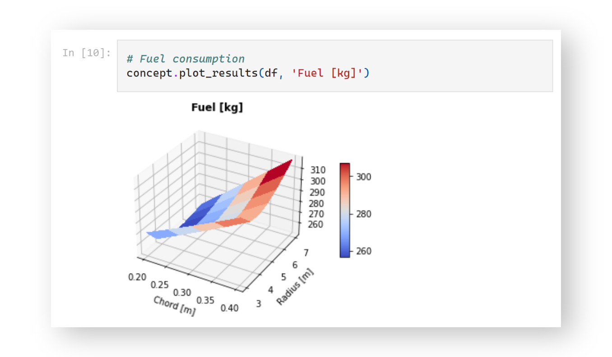
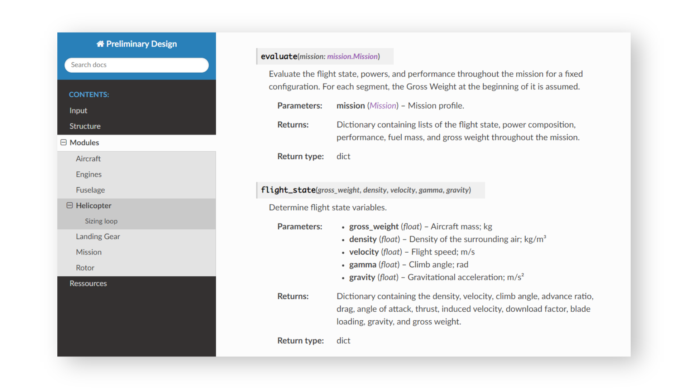

# HT Preliminary Design

Helicopter sizing code for the TUM Institute of Helicopter Technology.

## Motivation

This repository contains a sizing loop implementation in Python based on the lecture "Rotorcraft Engineering: Preliminary Design". The goal is to help students gain a better understanding of the preliminary design process and provide the tools to test different parameters. 

## Getting Started

Examples how to use the code are shown in the Jupyter notebook *python/_demo.ipynb*, with a PDF version in *docs/*.



## Requirements

To run the code, the following packages are required. 

YAML

```
pip install pyyaml
```

Pandas
```
pip install pandas
```

## Documentation

This project uses [Sphinx](https://www.sphinx-doc.org/), an open-source program for code documentation based on the docstrings within the code. Additionally, the documentation contains examples for the mission and configuration files, UML chart, sizing loop, and illustrations for the thrust calculation. To view the HTML version, open *docs/_build/html/index.html* in a web browser. A PDF version is available in *docs/*.




## About

TUM | Institute of Helicopter Technology

This work was carried out as part of a HiWi engagement supervised by Sumeet Kumar.

Author: Fabian Grimm, f.grimm@tum.de

2022