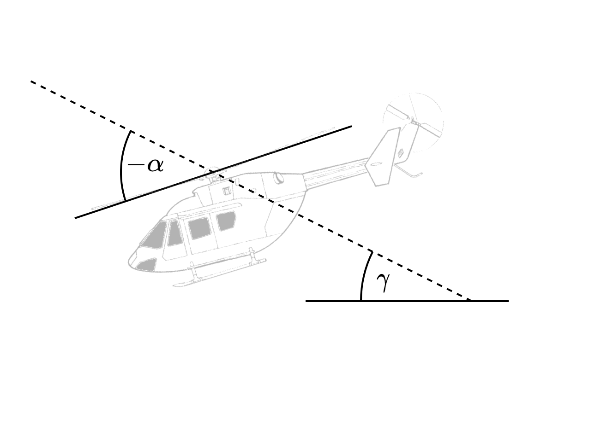
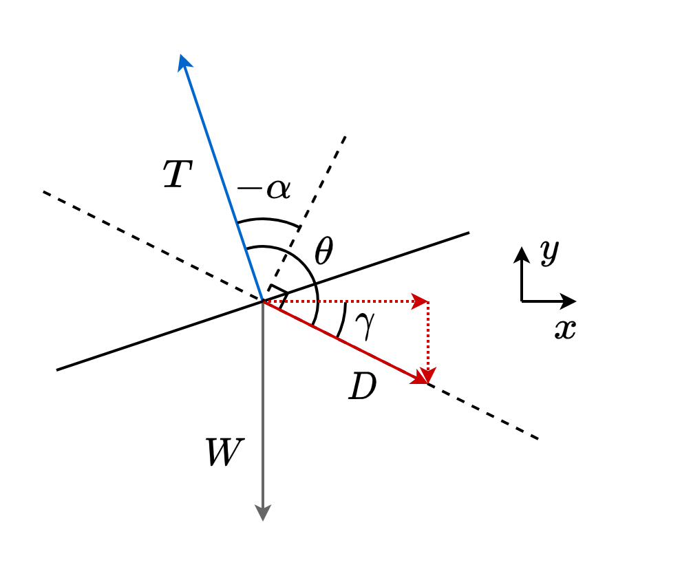

Aircraft
========

Thrust and angle of attack
--------------------------

   Definition of the climb angle and angle of attack.

Thrust vector:

.. math::

   \vec{T} = -\vec{W} - \vec{D} = - \begin{bmatrix}0 \\ - mg\end{bmatrix} - \begin{bmatrix}D \cos \gamma \\ - D \sin \gamma \end{bmatrix}

Angle of attack:

.. math::

   \alpha = \frac{\pi}{2} - \theta

with

.. math::

   \theta = \arccos(\bar{\vec{D}} \cdot \bar{\vec{T}}), \quad \bar{\vec{D}} = \frac{\vec{D}}{ ||\vec{D}|| } , \quad \bar{\vec{T}} = \frac{\vec{T}}{ ||\vec{T}|| }   

   Force balance between thrust, drag, and aircraft weight.

.. automodule:: aircraft
   :members:
   :undoc-members:
   :show-inheritance:
